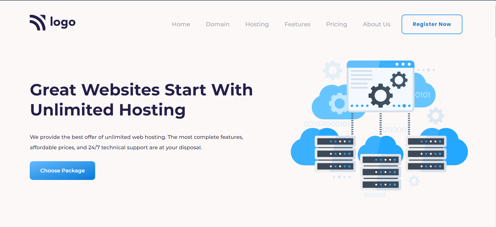

# [Project 11](https://jagadeeshproject11.netlify.app/)

 

# [Hosting Landing Page](https://jagadeeshproject11.netlify.app/)

  

  

>**Learnings from the project**

- Background properties - gradient colors
- hover effects
- media-queries & responsiveness
- more on flex, flex-properties

  

  &nbsp; 

 
